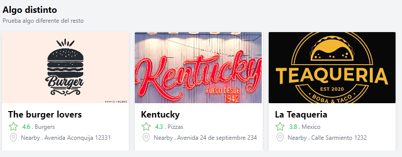

 <!-- My services -->
        <section class="my-services" id="services">
            <h2 class="section__title section__title--services">What I do</h2>
            

                

                    <h3>Design + Development</h3>
                    
Lorem ipsum dolor sit amet, consectetur adipiscing elit, sed do eiusmod tempor incididunt ut labore et dolore magna aliqua. Ut enim ad minim veniam, quis nostrud exercitation ullamco laboris nisi ut aliquip ex ea commodo consequat.

                
 <!-- / service -->
                
                

                    <h3>E-Commerce</h3>
                    
Lorem ipsum dolor sit amet, consectetur adipiscing elit, sed do eiusmod tempor incididunt ut labore et dolore magna aliqua. Ut enim ad minim veniam, quis nostrud exercitation ullamco laboris nisi ut aliquip ex ea commodo consequat.

                
 <!-- / service -->
                
                

                    <h3>WordPress</h3>
                    
Lorem ipsum dolor sit amet, consectetur adipiscing elit, sed do eiusmod tempor incididunt ut labore et dolore magna aliqua. Ut enim ad minim veniam, quis nostrud exercitation ullamco laboris nisi ut aliquip ex ea commodo consequat.

                
 <!-- / service -->
            
 <!-- / services -->
            
            <a href="#work" class="btn">My Work</a>
        </section>
        
        
        <!-- About me -->
        <section class="about-me" id="about">
           <h2 class="section__title section__title--about">Who I am</h2>
           
Designer & developer based out of NYC

           
           

               
Lorem ipsum dolor sit amet, consectetur adipiscing elit, sed do eiusmod tempor incididunt ut labore et dolore magna aliqua. Ut enim ad minim veniam, quis nostrud exercitation ullamco laboris nisi ut aliquip ex ea commodo consequat.

               
Lorem ipsum dolor sit amet, consectetur adipiscing elit, sed do eiusmod tempor incididunt ut labore et dolore magna aliqua. Ut enim ad minim veniam, quis nostrud exercitation ullamco laboris nisi ut aliquip ex ea commodo consequat.

           

           
           
        </section>

         

                    <h3>E-Commerce</h3>
                    
Lorem ipsum dolor sit amet, consectetur adipiscing elit, sed do eiusmod tempor incididunt ut labore et dolore magna aliqua. Ut enim ad minim veniam, quis nostrud exercitation ullamco laboris nisi ut aliquip ex ea commodo consequat.

                
 <!-- / service -->
                
                

                    <h3>WordPress</h3>
                    
Lorem ipsum dolor sit amet, consectetur adipiscing elit, sed do eiusmod tempor incididunt ut labore et dolore magna aliqua. Ut enim ad minim veniam, quis nostrud exercitation ullamco laboris nisi ut aliquip ex ea commodo consequat.

                
 <!-- / service -->

 <!-- My Work -->
        <section class="my-work" id="work">
            <h2 class="section__title section__title--work">My work</h2>
            
Take a look to some of my projects

            
            

                <!-- Portfolio item 01 -->
                
                
                <!-- Portfolio item 02 -->
                

                
                
                <!-- Portfolio item 03 -->
                
                
                <!-- Portfolio item 04 -->
                
                
                <!-- Portfolio item 05 -->
                
                <!--  -->
                
                <!-- Portfolio item 06 -->
                
                
            

              
             

                <a href="https://github.com/bpadros?tab=repositories" target="_blank" class="btn-item">Click here for more projects</a>
           
        

        </section>                